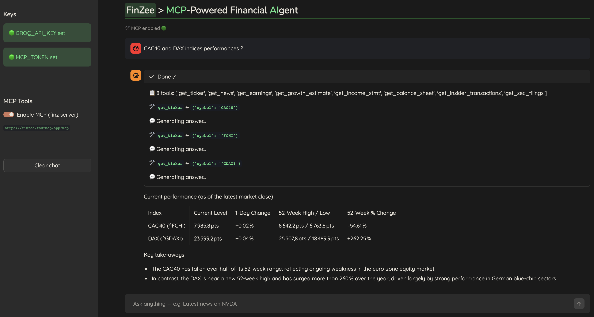

# streamlit-mcp-agent

> Streamlit Demo for Financial Agent MCP-Powered App

- LLM : Groq `GPT-OSS-20b`
- MCP Server : `Finzee MCP` (Real time stock market data)

> Install : 
1. Get GROQ_API and MCP_TOKEN.
2. Run : `streamlit run main.py`

> App :

